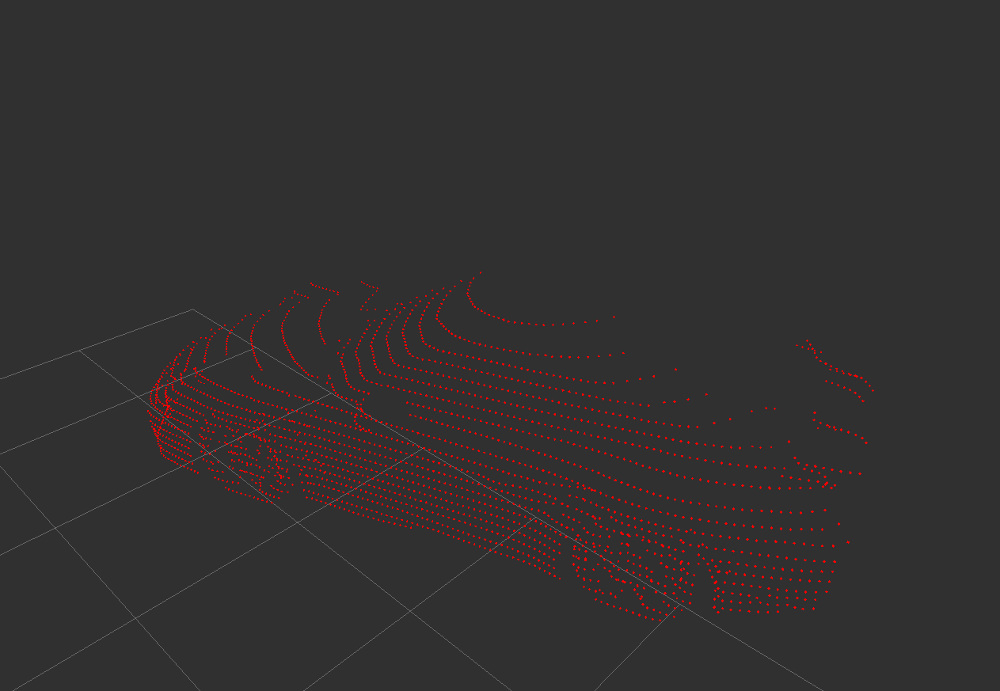

# Point Convolution and Map Regression Neural Net

Proof of concept project for doing object recognition in point clouds with a fully convolutional network.
The central innovations in this neural net are:

+ For each point in space a vector is predicted that should point from this point towards the object's middle point
+ The features for each point are only its relative positions to the neighbouring points in the lidar distance image


This avoids having to use any kind of pooling or fully connected layers, because
all computation can happen with convolution layers. Instead of predicting a set of objects,
the association of each point with an object is predicted.

The lidar data is used in an image format, which enables similar architecture to image recognition networks.
However the first layer works more akin to a graph convolution (one could of course say an image convolution is just
a special type of graph convolution): Given an adjacency distance (similar to image convolution kernel size)
the relative position to the adjacent vertices are used in a weighted sum. X,Y and Z coordinates
are used as channel informations.

The convolution layers are structured in modules similar to Inception Layers, just a bit smaller
to be more friendly to GPUs with smaller VRAM.

Training is implemented as a google colaboratory notebook, which enables free use of a NVIDIA Tesla K80.
At the moment the datasets are created synthetically by simulating a lidar sensor on 3d objects.

The network is implemented with pytorch. Summaries are created with tensorboardX and can be viewed 
by using tensorflow's tensorboard:
```
tensorboard --logdir summaries
```

## Sample net output




